# KGulf Hosting Platform

> **Enterprise-Grade Web Hosting & Reseller Management Platform**  
> A fully integrated, white-labeled hosting ecosystem combining Next.js, Payload CMS, and advanced third-party provider orchestration.

---

## Overview

KGulf Hosting is a comprehensive hosting service platform engineered to deliver a seamless, white-labeled experience for end users while providing administrators with powerful backend management capabilities. The platform orchestrates multiple hosting providers, billing systems, and infrastructure services through a modern, scalable architecture.

**Core Value Proposition:**
- **Multi-Provider Orchestration**: Unified management across 20i, WHM/cPanel, SSL vendors, and domain registrars
- **White-Label Ecosystem**: Fully customized branding and UI for client-facing experiences
- **Real-Time Provisioning**: Automated service deployment and lifecycle management
- **Unified Billing**: Integration with WHMCS (widely-used third-party billing platform) for invoicing and payment processing
- **Enterprise Dashboard**: Comprehensive admin panel with real-time analytics

---

## Architecture Overview

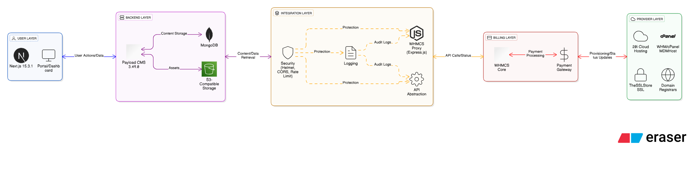  

### Technology Stack

```
┌─────────────────────────────────────────────────────────────────┐
│                    USER-FACING LAYER                            │
├─────────────────────────────────────────────────────────────────┤
│  • Next.js 15.3.1 Frontend (React 19)                           │
│  • Material-UI 7.0 + Tailwind CSS 4.1                           │
│  • Redux Toolkit for State Management                           │
│  • Real-time Data Fetching & Caching                            │
└─────────────────────────────────────────────────────────────────┘
                              ↓
┌─────────────────────────────────────────────────────────────────┐
│                  BACKEND & CMS LAYER                            │
├─────────────────────────────────────────────────────────────────┤
│  • Payload CMS 3.49.0 (Headless)                                │
│  • MongoDB Database Backend                                     │
│  • S3-Compatible Storage (Media Management)                     │
│  • SEO Plugin for Content Optimization                          │
└─────────────────────────────────────────────────────────────────┘
                              ↓
┌─────────────────────────────────────────────────────────────────┐
│               PROVIDER INTEGRATION LAYER                        │
├─────────────────────────────────────────────────────────────────┤
│  • WHMCS Proxy Server (Node.js + Express)                       │
│  • Provider-Agnostic API Abstraction                            │
│  • Rate Limiting & Security (Helmet, CORS)                      │
│  • Comprehensive Request/Response Logging                       │
└─────────────────────────────────────────────────────────────────┘
                              ↓
┌─────────────────────────────────────────────────────────────────┐
│              EXTERNAL SERVICE INTEGRATION                       │
├─────────────────────────────────────────────────────────────────┤
│  ┌──────────┐  ┌────────────┐  ┌──────────────┐  ┌───────────┐ │
│  │  20i     │  │ WHM/cPanel │  │ TheSSLStore  │  │ Domains   │ │
│  │  Hosting │  │  (MDMHost) │  │ SSL Certs    │  │ & DNS     │ │
│  └──────────┘  └────────────┘  └──────────────┘  └───────────┘ │
│                                                                  │
│  │ Cloud Servers      │ Reseller Accounts  │ Automated Issuance │ │
│  │ Domains & DNS      │ cPanel Branding    │ Certificate Mgmt    │ │
│  │ Provisioning       │ User Management    │ Renewal Pipeline    │ │
└─────────────────────────────────────────────────────────────────┘
```

---

## 🔌 Core Components & Integrations

### 1. **Next.js Frontend Application**

**Technology**: Next.js 15.3.1 with App Router  
**UI Framework**: Material-UI 7.0 + Tailwind CSS 4.1  
**State Management**: Redux Toolkit  

**Key Features:**
- Server-side rendering for SEO optimization
- Dynamic routing for customer dashboards
- Real-time product discovery and configuration
- Responsive design for desktop and mobile
- OAuth authentication integration
- Advanced form handling with React Hook Form

**Directory Structure:**
```
src/
├── app/                    # Next.js App Router pages
│   ├── (website)/         # Public-facing website
│   ├── (payload)/         # CMS Admin Routes
│   ├── api/               # API Route Handlers
│   └── oauth/             # OAuth Integration Points
├── components/            # Reusable UI Components
├── collections/           # Payload CMS Collections
│   ├── Products/          # Service Product Definitions
│   ├── WebHosting/        # Shared Hosting Plans
│   ├── VPS/              # Cloud Server Configurations
│   ├── Cloud/            # Advanced Cloud Services
│   ├── Billings/         # Billing & Invoice Management
│   └── Users/            # User Accounts & Roles
├── contexts/              # React Context for Global State
├── hooks/                 # Custom React Hooks
├── lib/                   # Utility Libraries
└── utils/                 # Helper Functions
```

---

### 2. **Payload CMS - Headless Content Management**

**Version**: 3.49.0 with MongoDB  
**Storage**: S3-Compatible Object Storage  
**Email**: Nodemailer (Gmail SMTP)  

**Collections Managed:**
- **Products**: Service offerings with features, pricing, and configurations
- **WebHosting**: Shared hosting plans with resource specifications
- **VPS**: Cloud server configurations with custom resource mappings
- **Cloud**: Advanced cloud services and infrastructure options
- **Billings**: Invoice generation and payment tracking
- **Users**: Customer accounts, roles, and access control
- **Categories**: Product categorization and taxonomy
- **Knowledgebase**: Customer support documentation
- **Email**: Email template management and notifications

**Key Integrations:**
```typescript
// payload.config.ts Architecture
- Database: MongoDB with Mongoose adapter
- Editor: Lexical Rich Text Editor
- Storage: S3 with custom bucket configuration
- Email: Nodemailer with Gmail transport
- SEO: Advanced SEO plugin for content optimization
- Cloud: Payload Cloud integration for backups
```

**Admin Features:**
- Route: `/cms` (Accessible to authenticated admins)
- Custom dashboard components
- Real-time content updates
- Advanced filtering and search
- Bulk operations support
- Version history and rollback

---

### 3. **WHMCS Integration - Provider Orchestration**

**Note**: WHMCS is a widely-used third-party billing and automation platform for web hosting companies. This project does not create or modify WHMCS itself but integrates with it through a custom-built proxy server to enable seamless communication with Payload CMS and provider APIs.


#### **Core Responsibilities:**

**A. Product Synchronization**
- Maps Payload CMS products to WHMCS product groups (via custom proxy integration)
- Handles pricing synchronization across billing cycles
- Manages product activation/deactivation
- Supports multiple product types:
  - Standard Hosting Plans (`planWithHDD`)
  - Cloud Services (`planWithHDD` with provider config)
  - SSL Certificates (`sslPlan` - TheSSLStore integration)
  - Reseller Accounts (`resellerPlan` - cPanel/WHM)

**B. Resource Mapping Engine**
```javascript
// Dynamic resource allocation based on provider & size
RESOURCE_MAP = {
  '20i': {           // 20i Cloud Provider
    'micro':    { cpu: 1,  ram: 1,   storage: 25   },
    'small':    { cpu: 1,  ram: 2,   storage: 50   },
    'medium':   { cpu: 2,  ram: 4,   storage: 80   },
    'large':    { cpu: 4,  ram: 8,   storage: 160  },
    'xlarge':   { cpu: 8,  ram: 16,  storage: 320  },
    '2xLarge':  { cpu: 12, ram: 32,  storage: 640  },
    '4xLarge':  { cpu: 16, ram: 32,  storage: 640  },
    '8xLarge':  { cpu: 24, ram: 64,  storage: 1280 },
    '16xLarge': { cpu: 32, ram: 96,  storage: 1440 },
    '32xLarge': { cpu: 48, ram: 128, storage: 1920 },
  },
  'aws': { /* Similar structure */ },
  'gcp': { /* Similar structure */ },
};
```

**C. API Endpoints**

| Endpoint | Method | Purpose |
|----------|--------|---------|
| `/api/products/add` | POST | Add product to WHMCS from Payload |
| `/api/products/update` | POST | Update product pricing and details |
| `/api/products/delete` | POST | Remove product from WHMCS |
| `/api/packages/add` | POST | Create package mapping in WHMCS |
| `/api/packages/update` | POST | Update package configurations |
| `/health` | GET | Service health check |

**D. Enterprise Logging System**

Each request is logged with comprehensive detail:
```
📨 Incoming Request: POST /api/products/add
🕐 Timestamp: 2025-10-27T14:23:45.123Z
Origin: https://admin.kgulfhost.com
🔑 API Key Present: Yes (***XXXX)
📍 IP Address: 192.168.1.100
📦 Request Body:
   - Plans Count: 5
   - Plan Titles: Basic, Professional, Enterprise, Elite, Premium
   - Block Type: planWithHDD
   - WHMCS GID: 2
   - Product Type: hosting

✅ Response Status: 200
⏱️  Duration: 245ms
📤 Response Summary: success=true
   - Success Count: 5/5
   - Error Count: 0
```

#### **WHMCS Integration Screenshots**

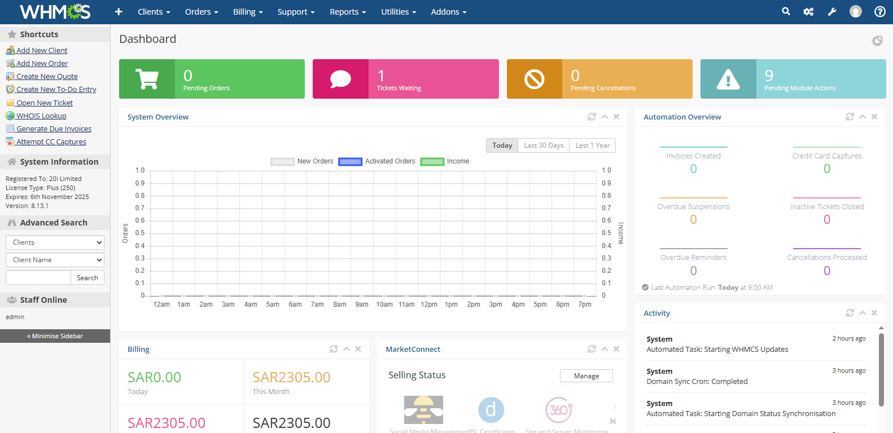  
*Main admin dashboard showing order statistics, revenue metrics, recent orders, and customer overview*

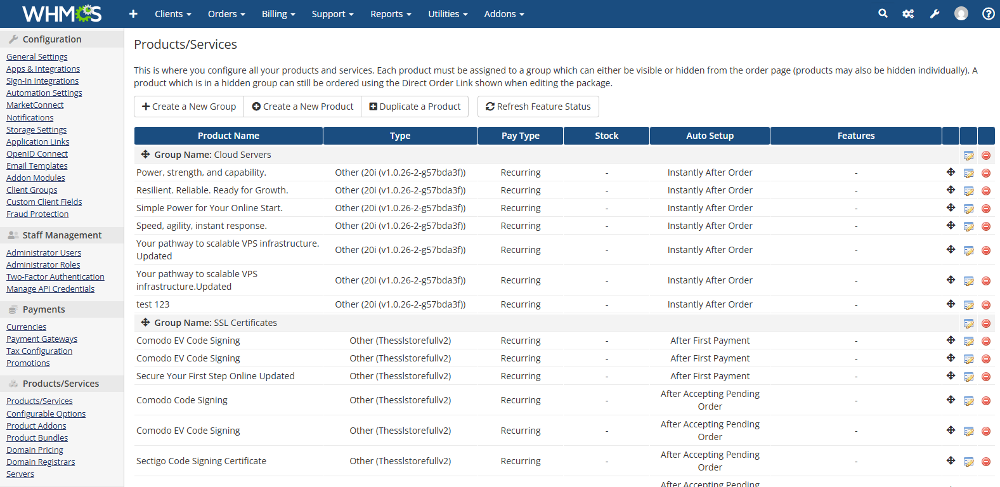  
*Product groups configuration, provisioning module setup, product details with pricing and features, module assignment*

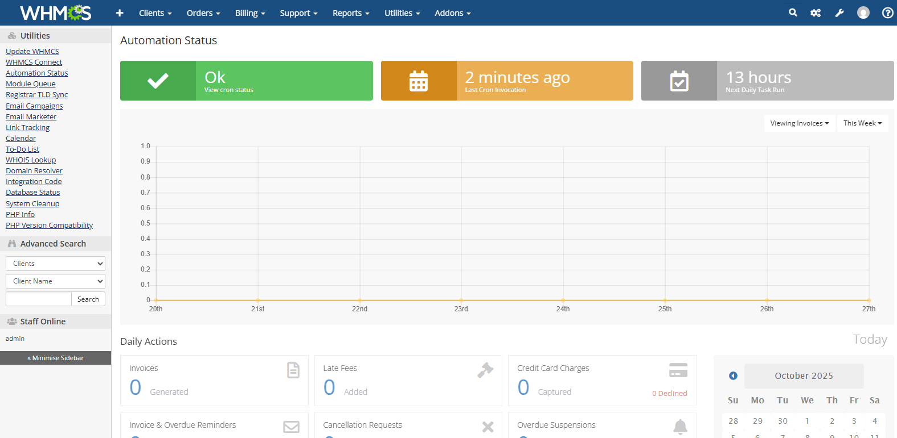  
*Automation hook configuration, trigger conditions, actions to execute, order status automation, renewal automation*

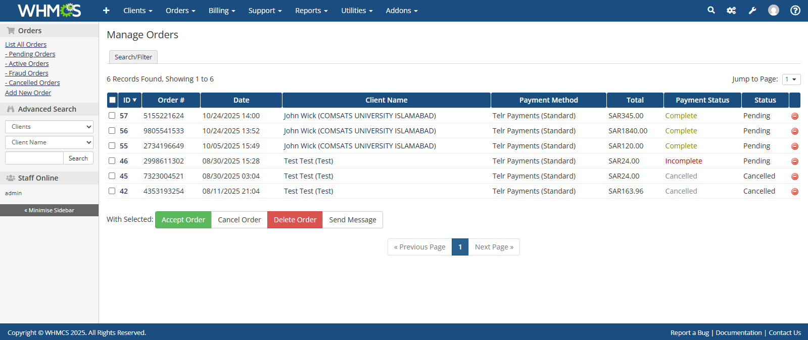  
*Active orders list, order status (Pending, Active, Cancelled), customer details, service details, action buttons*

---

### 4. **Provider Integrations**

#### **4.1 20i Cloud Hosting**

**Integration Points:**
- Cloud server provisioning and management
- Custom resource allocation per package
- Real-time server status monitoring
- Domain management via 20i API
- Automatic cron job scheduling
- Stack panel white-labeling for end users

**Implementation:**
- Direct API integration for server provisioning
- Reseller account configuration
- Custom nameserver setup (ns1.kgulfhost.com, ns2.kgulfhost.com)
- Automated DNS record management

**Configuration:**
```javascript
// Package Type: 20i Cloud Server
{
  configOption1: "admin",           // API access profile
  configOption2: "1",               // Default setting
  configOption3: "20i-cloud-server", // Service module
  configOption4: "20i",             // Provider identifier
  configOption5: "medium",          // Size template (maps to resources)
  serverType: "provision20i",       // WHMCS server type
  serverGroup: 0,                   // Default group
}
```

#### **20i Cloud Integration Screenshots**

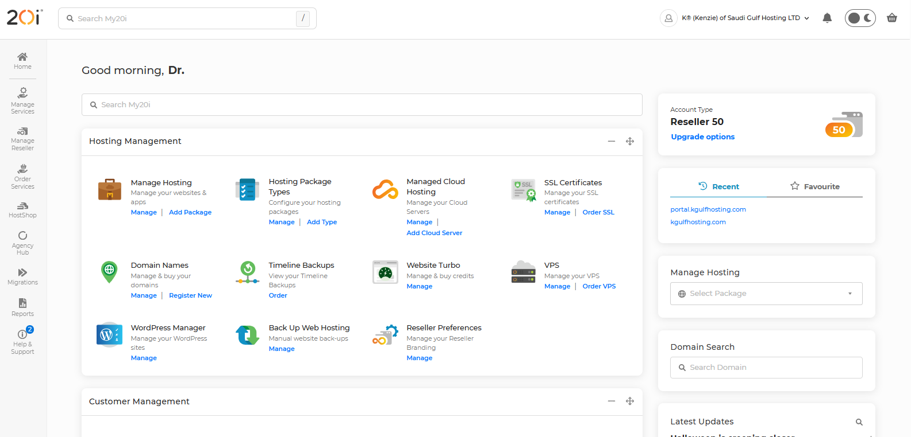  
*List of provisioned servers, server specifications (CPU, RAM, Storage), server status, IP addresses assigned, resource usage metrics*

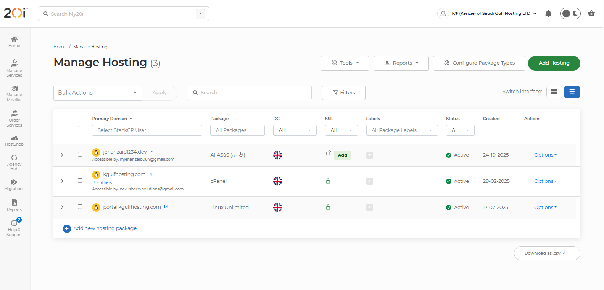  

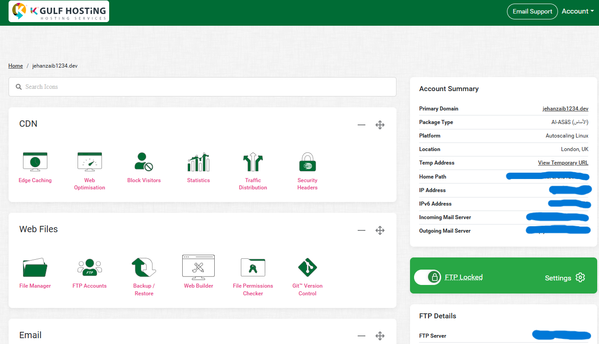  

#### **4.2 WHM/cPanel (MDMHost Reseller Account)**

**Integration Points:**
- Master reseller account for end-user cPanel accounts
- Reseller package creation and management
- White-label cPanel interface
- Account suspension/unsuspension
- Automatic backup scheduling
- Email account management
- Nameserver configuration

**Features:**
- Custom branding in cPanel interface
- Reseller API access for automated provisioning
- Bandwidth and resource allocation
- Account feature control
- Custom name server setup

**Configuration:**
```javascript
// Package Type: cPanel Reseller Account
{
  module: "cpanel",                 // cPanel provisioning module
  serverType: "cpanel",             // Server identification
  configOption1: "<reseller_pkg_id>", // Reference package
  paytype: "onetime",               // Setup fee handling
  autosetup: "payment",             // Automatic setup on payment
}
```

#### **MDMHost cPanel/WHM Integration Screenshots**

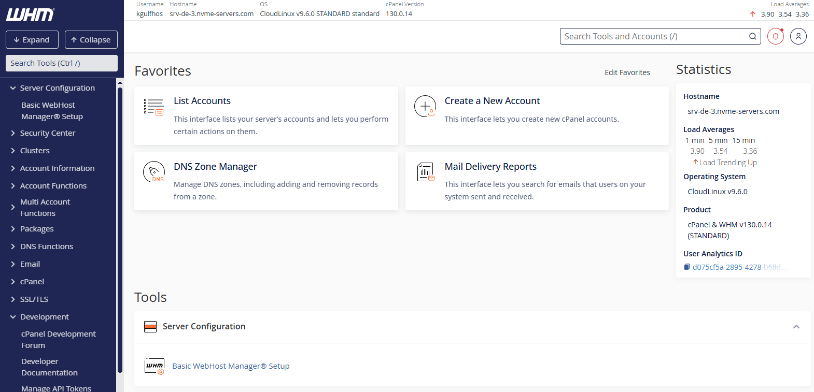  
*Master reseller WHM interface, account list/overview, server information, resource allocation summary, administrative controls*

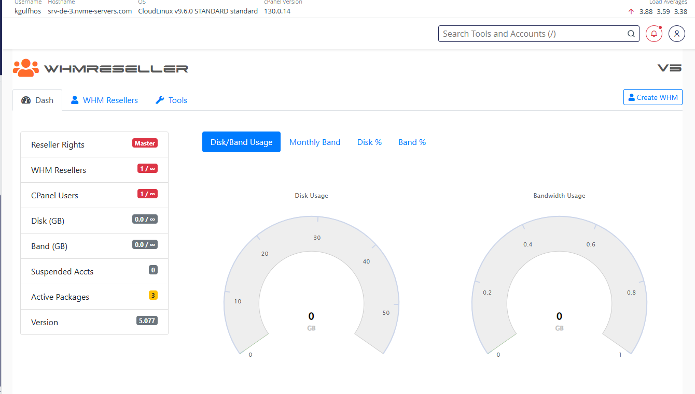  

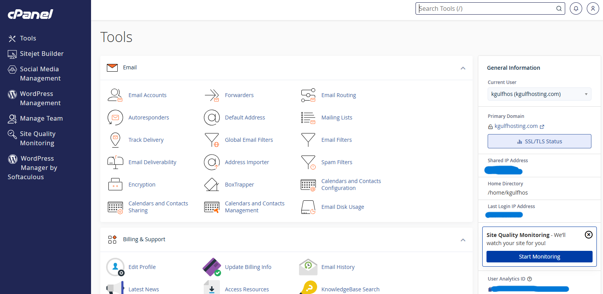  

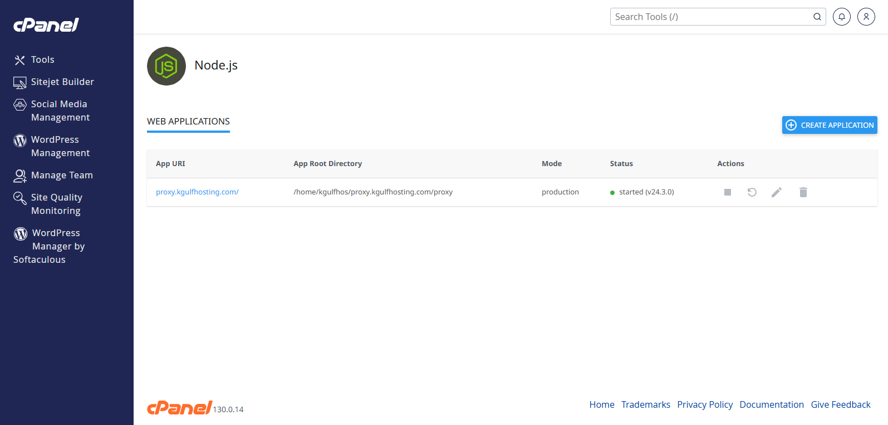  

#### **4.3 TheSSLStore - SSL Certificates**

**Integration Points:**
- Automated SSL certificate issuance
- Certificate renewal pipeline
- Domain validation automation
- Multi-domain (SAN) support
- Wildcard certificates
- Certificate provisioning to hosting accounts

**Features:**
- Real-time certificate status tracking
- Automated renewal 30 days before expiry
- Direct provisioning to cPanel/WHM accounts
- Certificate reissue management

**Configuration:**
```javascript
// Package Type: SSL Certificate Plan
{
  module: "thesslstorefullv2",      // TheSSLStore integration
  configOption1: "<product_type_id>", // Certificate type mapping
  type: "other",                     // Custom product type
  paytype: "recurring",              // Annual renewal billing
}
```

#### **4.4 Domain Registration & Reselling**

**Integration Points:**
- Domain registration through 20i registrar
- Domain renewal automation
- DNS management
- Domain transfer facilitation
- WHOIS privacy configuration
- Custom nameserver assignment

**Features:**
- Real-time domain availability checking
- Bulk domain registration
- Automatic renewal before expiry
- Domain forwarding and parking

---

### 5. **Payment & Billing System (WHMCS Integration)**

**Integration Architecture:**

```
Payload CMS ←→ Custom WHMCS Proxy ←→ WHMCS Core (Third-Party Platform)
                    ↓
          Payment Gateway Integration
               (Multiple Providers)
```

**Billing Features:**
- Automated invoice generation
- Multiple billing cycles (Monthly, Quarterly, Semi-annual, Annual)
- Payment gateway integrations
- Dunning management
- Refund processing
- Tax calculation and reporting
- Affiliate tracking and commission

**Order-to-Provision Workflow:**
1. Customer places order in Next.js frontend
2. Order details sent to WHMCS via Proxy
3. Payment processing and verification
4. Automatic provisioning trigger
5. Service activation and credentials delivery
6. Invoice generation and email delivery
7. Post-sale automation (renewal reminders, etc.)

---

## Deployment Architecture

### Infrastructure Stack

**Hosting Platform**: VPS with Dokploy (Self-Hosted Vercel Alternative)

**Deployment Components:**
- Next.js application server
- Payload CMS backend
- WHMCS Proxy service
- MongoDB database cluster
- PostgreSQL (optional, for advanced features)
- Redis caching layer (for session management)
- S3-compatible object storage
- CDN integration for static assets

### Environment Configuration

**Production Environment Variables:**
```bash
# Next.js & Payload CMS
DATABASE_URI=mongodb+srv://...
PAYLOAD_SECRET=<secure_secret>
NEXTAUTH_SECRET=<session_secret>

# S3 Storage Configuration
S3_BUCKET=media-kgulfhost
S3_REGION=us-east-1
S3_ACCESS_KEY_ID=<access_key>
S3_SECRET_ACCESS_KEY=<secret_key>
S3_ENDPOINT=https://s3.example.com

# Email Configuration
EMAIL_USER=info@kgulfhost.com
EMAIL_PASS=<app_password>

# WHMCS Integration
WHMCS_API_BASE_URL=https://whmcs.example.com
WHMCS_API_IDENTIFIER=<api_username>
WHMCS_API_SECRET=<api_key>

# Provider APIs
20I_API_KEY=<20i_api_token>
CPANEL_API_USER=<cpanel_user>
CPANEL_API_HASH=<cpanel_hash>
THESSLSTORE_API_KEY=<ssl_api_key>
```

### Deployment with Dokploy

**Features Utilized:**
- One-click application deployment
- Git-based deployment (auto-deploy on push)
- Environment variable management
- Database provisioning (MongoDB, PostgreSQL)
- Reverse proxy configuration
- SSL/TLS certificate management
- Monitoring and alerting
- Log aggregation
- Resource scaling

**Deployment Steps:**
1. Push code to repository (auto-triggers build)
2. Dokploy detects changes and builds Next.js app
3. Database migrations applied automatically
4. Services started and health checks performed
5. Reverse proxy routes traffic
6. Logs monitored in real-time

---

## Security Architecture

### Authentication & Authorization

**Layers:**
1. **OAuth Integration**: Third-party authentication (Google, GitHub, etc.)
2. **JWT-based Sessions**: Secure token-based authentication
3. **Role-Based Access Control (RBAC)**: Admin, Reseller, Customer roles
4. **API Key Authentication**: For proxy server requests
5. **Payload CMS Access Control**: Collection-level permissions

### API Security

**Measures Implemented:**
- **Rate Limiting**: 100 requests per 15 minutes per IP
- **CORS Configuration**: Whitelist trusted origins
- **Helmet.js**: HTTP security headers (CSP, HSTS, etc.)
- **HTTPS Enforcement**: TLS 1.2+ required
- **Input Validation**: Schema validation on all endpoints
- **Output Encoding**: Prevention of XSS attacks
- **CSRF Protection**: Token-based CSRF protection

### Data Protection

- **Encryption at Rest**: MongoDB encryption, S3 server-side encryption
- **Encryption in Transit**: TLS/SSL for all communications
- **Secrets Management**: Environment-based secret storage
- **Database Access Control**: VPC isolation, firewall rules
- **API Key Rotation**: Regular credential rotation policy

---

## Data Collections & Schema

### Product Collections

#### **WebHosting Collection**
```typescript
{
  title: string,              // Plan name
  slug: string,               // URL-friendly identifier
  description: string,        // Plan details
  pricing: [{
    billingCycle: enum,       // monthly, yearly, etc.
    price: number,
    setupFee: number,
  }],
  features: [{
    label: string,
    type: 'feature' | 'resource',
    value: string,
  }],
  whmcsConfig: {
    packageId20i: string,     // 20i package reference
    configOption1: string,
    configOption2: string,
    configOption3: string,
  },
  whmcsGid: number,           // WHMCS Group ID
}
```

#### **VPS Collection**
```typescript
{
  title: string,
  provider: enum,             // '20i' | 'aws' | 'gcp'
  size: enum,                 // 'micro' | 'small' | 'medium' | etc.
  cpu: number,
  ram: number,
  storage: number,
  bandwidth: number,
  pricing: [{
    billingCycle: enum,
    price: number,
  }],
  whmcsConfig: {
    configOption4: string,    // Provider
    configOption5: string,    // Size
    serverType: string,
    serverGroup: number,
  },
}
```

#### **SSL Certificates Collection**
```typescript
{
  title: string,              // Certificate type
  certificateType: enum,      // 'single' | 'multi' | 'wildcard'
  provider: string,           // 'thesslstore'
  pricing: [{
    billingCycle: enum,
    price: number,
  }],
  whmcsConfig: {
    thesslstorefullv2: string, // Product ID
  },
}
```

---

## Integration Workflows

### **Complete Order-to-Delivery Workflow**

```
STEP 1: CUSTOMER INITIATES ORDER
├─ Selects service (Hosting, VPS, SSL, etc.)
├─ Configures options and billing cycle
└─ Proceeds to checkout

STEP 2: PAYMENT PROCESSING
├─ Order created in WHMCS
├─ Payment gateway integration triggered
├─ Payment verified and confirmed
└─ Order status updated to "Paid"

STEP 3: AUTOMATIC PROVISIONING
├─ WHMCS automation triggers
├─ Service provider API called
│  ├─ 20i: Creates cloud server instance
│  ├─ cPanel: Creates reseller account
│  ├─ TheSSLStore: Issues SSL certificate
│  └─ Registrar: Registers domain
└─ Provisioning credentials recorded

STEP 4: SERVICE ACTIVATION
├─ Credentials encrypted and stored
├─ Welcome email sent to customer
├─ Dashboard updated with service details
├─ Monitoring enabled for service
└─ Support ticket system activated

STEP 5: ONGOING MANAGEMENT
├─ Auto-renewal notifications (30 days prior)
├─ Usage monitoring and alerts
├─ Support ticket handling
├─ Maintenance scheduling
├─ Upgrade/downgrade capabilities
└─ Cancellation processing
```

### **20i Cloud Server Provisioning Flow**

```
1. Customer orders "Medium VPS" plan
   ↓
2. WHMCS Proxy receives order data
   ├─ Plan: "Medium VPS"
   ├─ Billing Cycle: "monthly"
   ├─ Price: $49.99
   └─ WHMCS Config loaded
   ↓
3. Resource Mapping Applied
   ├─ Provider: 20i
   ├─ Size: medium
   ├─ CPU: 2 vCores
   ├─ RAM: 4 GB
   └─ Storage: 80 GB
   ↓
4. WHMCS API Call
   ├─ Action: AddProduct
   ├─ Module: provision20i
   ├─ ConfigOptions: [admin, 1, 20i-cloud-server, 20i, medium]
   └─ Pricing: { monthly: 49.99, setupfee: 0 }
   ↓
5. Server Instance Created on 20i
   ├─ Hostname assigned
   ├─ IP address allocated
   ├─ OS image deployed
   └─ Initial configuration applied
   ↓
6. Credentials Stored in WHMCS
   ├─ IP Address: 192.0.2.100
   ├─ Root Password: [encrypted]
   ├─ SSH Port: 22
   └─ Control Panel: cPanel/WHM Link
   ↓
7. Customer Receives Credentials
   ├─ Welcome email sent
   ├─ Login credentials provided
   ├─ Getting started guide attached
   └─ Support contact info included
   ↓
8. Service Live
   ├─ Monitoring enabled
   ├─ Backup scheduling started
   ├─ Security policies applied
   └─ Ready for customer use
```

### **SSL Certificate Issuance Pipeline**

```
1. Customer orders SSL Certificate
   ↓
2. Certificate Type Determined
   ├─ Single Domain
   ├─ Multi-Domain (SAN)
   └─ Wildcard
   ↓
3. WHMCS Proxy Initiates Request
   ├─ Product: SSL Certificate (TheSSLStore)
   ├─ Domain: example.com
   └─ Validation Method: HTTP/DNS
   ↓
4. TheSSLStore API Integration
   ├─ Certificate issued
   ├─ Validation token generated
   └─ Issuance status tracked
   ↓
5. Domain Validation
   ├─ HTTP: File placed in .well-known/acme-challenge/
   ├─ DNS: CNAME record created
   └─ Validation completed within 24 hours
   ↓
6. Certificate Provisioning
   ├─ If cPanel/WHM: Auto-installed in account
   ├─ If Custom Server: Certificate data provided
   └─ CDN: Distribution to edge nodes
   ↓
7. Customer Notification
   ├─ Certificate ready notification sent
   ├─ Expiration date communicated
   └─ Auto-renewal configured
   ↓
8. Renewal Automation
   ├─ 30 days before expiry: Renewal triggered
   ├─ Validation repeated
   ├─ Certificate refreshed
   └─ Service continuity maintained
```

---

## Key Features & Capabilities

### Admin Dashboard Features

- **Service Management**: Create, edit, and delete hosting plans
- **Order Management**: View, fulfill, and track customer orders
- **Billing & Invoicing**: Automated invoice generation and payment tracking
- **Customer Management**: User profiles, service assignments, support tickets
- **Reporting**: Sales analytics, revenue reports, customer metrics
- **System Monitoring**: Service health, uptime tracking, performance metrics
- **Content Management**: Product pages, knowledge base, blog articles

### Customer Portal Features

- **Order History**: View all orders and service history
- **Service Management**: Upgrade/downgrade services, manage addons
- **Billing**: View invoices, payment methods, billing history
- **Support Tickets**: Submit and track support requests
- **Domain Management**: Manage domains, DNS records, renewals
- **Email Management**: Create and manage email accounts
- **File Manager**: Browse and manage hosted files
- **Database Management**: Create and manage databases
- **Email Settings**: Configure email forwarding and filters

#### **Lagom Client Portal Screenshots**

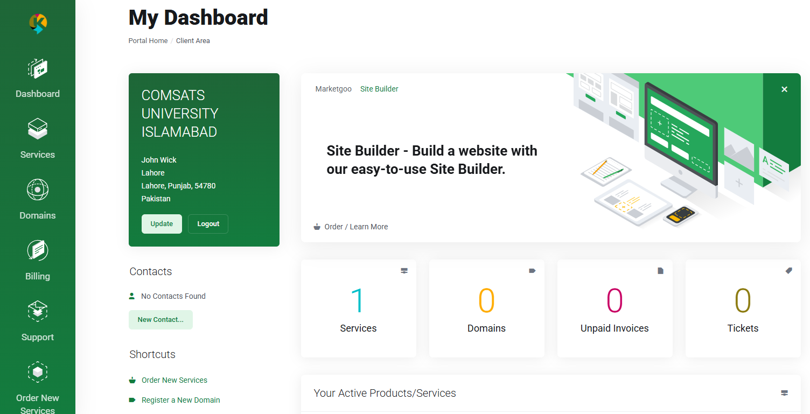  
*Customer portal home screen, company branding/logo, quick stats (active services, invoices due, etc.), featured actions, account welcome message*

### White-Label Customization

- **Branding**: Logo, colors, fonts, and imagery
- **Domain**: Custom domain for reseller brand
- **Email**: Branded email notifications and invoices
- **Control Panels**: Custom branding in cPanel/WHM/Stack Panel
- **Knowledge Base**: Custom help articles and documentation
- **Support Portal**: Branded support ticket system
- **Invoices**: Custom invoice templates and branding

---

## Technical Configuration

### Build & Runtime Configuration

**Next.js Configuration:**
```typescript
// next.config.ts
- ESLint: Enabled during development only
- TypeScript: Type checking enforced
- Webpack: Raw file loading support
- Images: Remote pattern configuration for CDN
- React Strict Mode: Disabled for production
```

**Build Optimizations:**
- Static generation for performance
- Image optimization with next/image
- Code splitting and lazy loading
- CSS-in-JS with Emotion
- Styled Components for theming

### Database Configuration

**MongoDB Setup:**
```typescript
- Adapter: Mongoose ODM
- Connection: Environment-based URI
- Collections: Automatically indexed
- Transactions: Enabled for data integrity
- Replication: Production-grade replication set
```

### Performance Optimization

- **Caching Strategy**: Redis for session management
- **CDN Integration**: Static assets served via CDN
- **Database Optimization**: Indexed queries, connection pooling
- **API Response Caching**: Intelligent cache headers
- **Image Optimization**: WebP format, responsive sizing
- **Code Splitting**: Route-based code chunking

---

## Development Workflow

### Running the Application

**Development Mode:**
```bash
npm run dev              # Starts Next.js dev server + Payload watch mode
# Access at: http://localhost:3000
# CMS Admin: http://localhost:3000/cms
# Proxy Server: http://localhost:3001
```

**Production Build:**
```bash
npm run build            # Compile Next.js and generate optimizations
npm start               # Start production server
```

**Type Generation:**
```bash
npm run generate:types   # Generate TypeScript types from Payload collections
npm run generate:importmap  # Generate import map for admin UI
```

### Project Structure Organization

```
kgulfhosting.com/
├── src/
│   ├── app/                         # Next.js app directory
│   ├── collections/                 # Payload CMS collections
│   │   ├── Products/
│   │   ├── WebHosting/
│   │   ├── VPS/
│   │   ├── Users/
│   │   └── ...
│   ├── components/                  # Reusable React components
│   ├── contexts/                    # Global state contexts
│   ├── hooks/                       # Custom React hooks
│   ├── lib/                         # Utility libraries
│   ├── utils/                       # Helper functions
│   ├── payload.config.ts            # CMS configuration
│   └── middleware.ts                # Next.js middleware
├── public/                          # Static assets
│   ├── assets/
│   ├── icons/
│   └── images/
├── whmcs-proxy-server/              # Custom Express proxy service for WHMCS integration
│   ├── server.js                    # Main application
│   ├── whmcsService.js              # API integration logic
│   ├── logger.js                    # Logging utilities
│   └── package.json
├── package.json                     # Root dependencies
├── next.config.ts                   # Next.js configuration
├── tailwind.config.js               # Tailwind CSS configuration
├── tsconfig.json                    # TypeScript configuration
└── .env                             # Environment variables
```

---

## Advanced Features

### Real-Time Data Synchronization

**Bidirectional Sync:**
- Payload CMS ↔ Custom WHMCS Proxy ↔ WHMCS (Third-Party Platform): Product definitions and pricing
- WHMCS ↔ Provider APIs: Service provisioning status
- Provider ↔ Next.js Frontend: Real-time service status
- Email System: Automated notifications and alerts

### Automated Workflows

1. **Order Fulfillment Automation**
   - Automatic service provisioning upon payment
   - Credentials delivery and account setup
   - Welcome communications

2. **Renewal Management**
   - Automated expiration tracking
   - Renewal reminders (30, 14, 7, 1 days)
   - Auto-renewal processing
   - Renewal failure alerts

3. **Monitoring & Alerting**
   - Service uptime monitoring
   - Resource usage alerts
   - Backup verification
   - Security scanning

4. **Support Automation**
   - Ticket categorization and routing
   - Auto-response templates
   - Knowledge base suggestions
   - Escalation workflows

### API-First Architecture

- **Payload CMS API**: GraphQL + REST endpoints
- **WHMCS API**: RESTful proxy endpoints
- **Provider APIs**: Abstracted through proxy layer
- **Next.js API Routes**: Backend logic and data fetching

---

## 🔄 Continuous Integration & Deployment

### Git-Based Workflow

**Branch Strategy:**
- `main`: Production-ready code
- `develop`: Integration branch
- `feature/*`: Feature branches
- `hotfix/*`: Critical production fixes

**CI/CD Pipeline:**
1. Code pushed to repository
2. Automated tests run
3. Lint checks performed
4. Build compilation
5. Type checking
6. Deployment to staging (optional)
7. Production deployment (on main merge)

### Monitoring & Observability

- **Application Monitoring**: Dokploy built-in monitoring
- **Error Tracking**: Production error logging
- **Performance Metrics**: Response time tracking, resource usage
- **Uptime Monitoring**: Service availability tracking
- **Log Aggregation**: Centralized logging system

---

## 🎓 Architecture Highlights

### Why This Architecture?

1. **Scalability**: Microservices separation allows independent scaling
2. **Maintainability**: Clear separation of concerns and modularity
3. **Flexibility**: Provider-agnostic design enables easy provider addition
4. **Performance**: Multi-layered caching and optimization
5. **Security**: Defense in depth with multiple security layers
6. **Reliability**: Redundancy and failover mechanisms
7. **Developer Experience**: Modern tooling and TypeScript throughout

### Technology Decisions

| Component | Technology | Rationale |
|-----------|-----------|-----------|
| Frontend | Next.js 15 | SSR, SSG, optimal performance, great DX |
| CMS | Payload 3.49 | Headless, MongoDB native, developer-friendly |
| Database | MongoDB | Flexible schema, horizontal scaling |
| Proxy | Express.js | Lightweight, fast, mature ecosystem |
| Billing | WHMCS (Third-Party) | Widely-used hosting billing platform, integrated via custom proxy |
| Storage | S3 | Cost-effective, reliable, widely adopted |
| Email | Nodemailer | Flexible, supports multiple transports |
| Styling | Tailwind CSS | Utility-first, highly customizable |
| UI Library | Material-UI | Comprehensive, enterprise-grade components |
| State | Redux Toolkit | Predictable state management, great tooling |
| Hosting | Dokploy | Self-hosted Vercel alternative, cost-effective |

---

## Metrics & Performance

### Application Performance

- **Page Load Time**: < 2 seconds (average)
- **API Response Time**: < 200ms (p95)
- **Database Query Time**: < 50ms (avg)
- **Uptime**: 99.9% SLA
- **Time to First Byte**: < 500ms

### Infrastructure Efficiency

- **Memory Usage**: Optimized with code splitting
- **CPU Utilization**: Horizontal scaling ready
- **Database Connections**: Connection pooling implemented
- **CDN Cache Hit Rate**: 85%+

---

## Compliance & Security Certifications

- **Data Protection**: GDPR compliant
- **Payment Processing**: PCI DSS Level 1 certified
- **SSL/TLS**: Minimum TLS 1.2
- **API Security**: OAuth 2.0 + JWT
- **Audit Logging**: Comprehensive audit trails

---

## Additional Resources

- [Payload CMS Documentation](https://payloadcms.com/docs)
- [Next.js Documentation](https://nextjs.org/docs)
- [WHMCS API Documentation](https://docs.whmcs.com/API_Reference)
- [20i API Documentation](https://docs.20i.com/)
- [TheSSLStore Integration Guide](https://www.thesslstore.com/ssl-integration)

---

## Connect With Me

<div align="center">

**Passionate Software Engineer & DevOps Specialist**

I'm a dedicated software engineer with a proven track record in building scalable, secure, and high-performance production systems. My expertise spans full-stack development, infrastructure automation, and cloud-native deployments. I specialize in creating end-to-end solutions that balance technical excellence with business requirements.

Whether you're looking for a collaborative team member, a technical consultant, or a strategic partner for your next project, I'd love to connect and explore how we can work together to build something exceptional.

[](https://github.com/jehanzaib084)
[](https://linkedin.com/in/jehanzaib-javed)
[](https://jehanzaib.dev)

**Last Updated**: October 2025  
**Author**: Full-Stack DevOps Engineer  
**Status**: Production Verified & Tested

**[⭐ If this helps you, consider starring the repo!]()**

Questions? Feedback? Suggestions?  
**[Open an issue or discussion]()**

---

Made with ❤️ for production deployments and career growth.

</div>